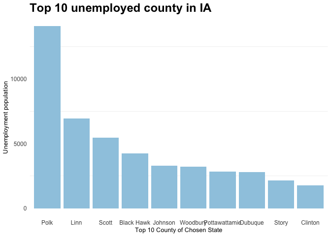
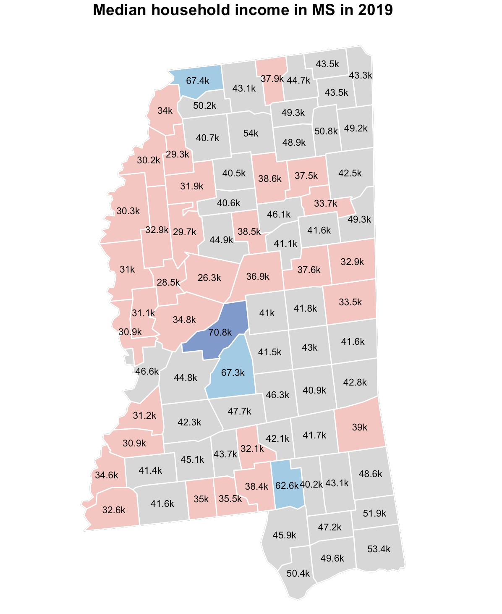
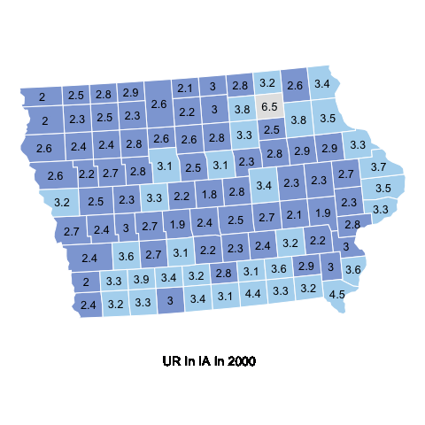
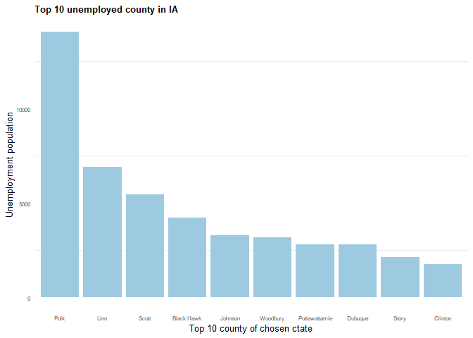
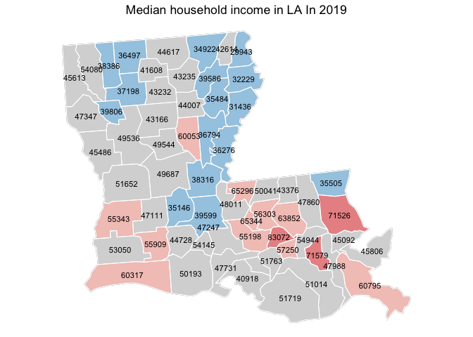

<!-- README.md is generated from README.Rmd. Please edit that file -->

# unemployedR

<!-- badges: start -->
<!-- badges: end -->

The goal of unemployedR is to visualize unemployed rate and household
income compare with time across United States.

## Installation

You can install the development version of finalproject like so:

``` r
# install.packages("unemployedR")
```

## Example

This is a basic example which shows you how to solve a common problem:

``` r
library(unemployedR)

## data cleaning
file=dataclean("https://www.ers.usda.gov/webdocs/DataFiles/48747/Unemployment.csv")
str(file)
#> 'data.frame':    290441 obs. of  7 variables:
#>  $ FIPS_Code: int  0 0 0 0 0 0 0 0 0 0 ...
#>  $ State    : chr  "US" "US" "US" "US" ...
#>  $ Area_name: chr  "United States" "United States" "United States" "United States" ...
#>  $ state    : chr  NA NA NA NA ...
#>  $ Attribute: chr  "Civilian_labor_force_" "Employed_" "Unemployed_" "Unemployment_rate_" ...
#>  $ year     : num  2000 2000 2000 2000 2001 ...
#>  $ Value    : num  1.43e+08 1.37e+08 5.70e+06 3.99 1.44e+08 ...

# plot 


## The unemployment rate in county level for a specific state and a year
plotunemployed(file, 2018, "NJ")
#> Warning in showSRID(uprojargs, format = "PROJ", multiline = "NO", prefer_proj =
#> prefer_proj): Discarded datum unknown in Proj4 definition
```



``` r


## 2019 median household income in county level for a specific state.
plotmedianhouseholdincome(file,"NJ")
```



``` r
## Unemployment Rate in IA from 2000 to 2020 
plotunemployed_animation(file, "NJ")
```




``` r
## top 10 unemployed county histogram
stateunemployed(file,2011,"IA")
```



``` r
## The unemployment rate along with years
plotunemployed_time(file,"IA")
```



You’ll still need to render `README.Rmd` regularly, to keep `README.md`
up-to-date. `devtools::build_readme()` is handy for this. You could also
use GitHub Actions to re-render `README.Rmd` every time you push. An
example workflow can be found here:
<https://github.com/r-lib/actions/tree/v1/examples>.

In that case, don’t forget to commit and push the resulting figure
files, so they display on GitHub and CRAN.
