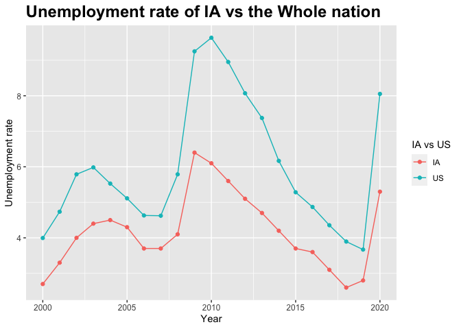

<!-- README.md is generated from README.Rmd. Please edit that file -->

# unemployedR

<!-- badges: start -->
<!-- badges: end -->

The goal of `unemployedR` is to visualize unemployed rate and household
income compare with time across United States.

Here are links to our GitHub
[repository](https://github.com/zzhou93/unemployedR) where the code for
the package is stored and to the package
[website](https://zzhou93.github.io/unemployedR) where more information
about the package is well shown.

And the shiny app can be found under the`inst/shiny-example` folder or
ran the `unemployedR::runExample()`.

## Installation

You can install the development version of `unemployedR` like so:

``` r
# install.packages("unemployedR")
```

## Example

This is a basic example which shows you how to solve a common problem:

### `dataclean(url)`

This function is used to clean the data for the future plots.

The example shows the structure of the data file after cleaning.

``` r
library(unemployedR)

# data cleaning
file=dataclean("https://www.ers.usda.gov/webdocs/DataFiles/48747/Unemployment.csv")

str(file)
#> 'data.frame':    290441 obs. of  7 variables:
#>  $ FIPS_Code: int  0 0 0 0 0 0 0 0 0 0 ...
#>  $ State    : chr  "US" "US" "US" "US" ...
#>  $ Area_name: chr  "United States" "United States" "United States" "United States" ...
#>  $ state    : chr  NA NA NA NA ...
#>  $ Attribute: chr  "Civilian_labor_force_" "Employed_" "Unemployed_" "Unemployment_rate_" ...
#>  $ year     : num  2000 2000 2000 2000 2001 ...
#>  $ Value    : num  1.43e+08 1.37e+08 5.70e+06 3.99 1.44e+08 ...
```

### `plotunemployed(file, yr, State.name)`

This function is used to plot the unemployment rate in county level for
a specific state and a year.

The example shows the unemployment rate in county level for NJ in 2018.

``` r
plotunemployed(file, 2018, "NJ")
```


### `plotmedianhouseholdincome(file, State.name)`

This function is used to plot the 2019 median household income in county
level for a specific state.

The example shows 2019 median household income in county level for MS

``` r
plotmedianhouseholdincome(file,"MS")
```


### `plotunemployed_animation(file, State.name)`

This function is used to provide animation plot of the unemployment rate
in county level for a specific state.

The example shows unemployment rate in IA from 2000 to 2020.

``` r
plotunemployed_animation(file, "IA")
```


### `plotunemployed_time(file, local.name)`

This function is used to plot the unemployment rate along with years.

The example shows unemployment rate in IA along with years.

``` r
plotunemployed_time(file, "IA")
```



### `stateunemployed(file, yr, State.name`

This function is used to plot top 10 unemployed county histogram in
selected state and a year.

The example shows top 10 unemployed counties in IA in 2011 histogram.

``` r
stateunemployed(file, 2011,"IA")
```


You’ll still need to render `README.Rmd` regularly, to keep `README.md`
up-to-date. `devtools::build_readme()` is handy for this. You could also
use GitHub Actions to re-render `README.Rmd` every time you push. An
example workflow can be found here:
<https://github.com/r-lib/actions/tree/v1/examples>.

In that case, don’t forget to commit and push the resulting figure
files, so they display on GitHub and CRAN.
